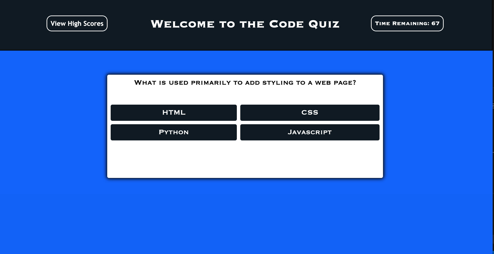
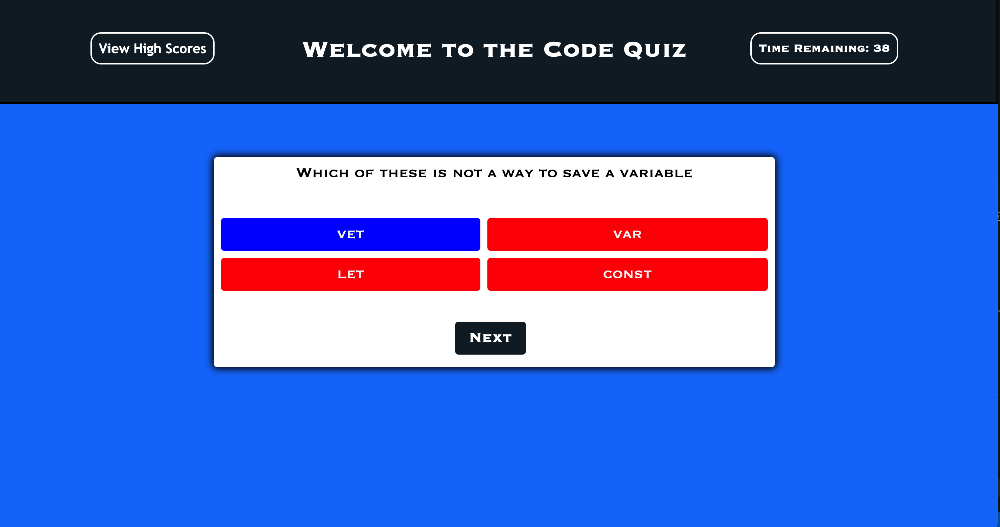
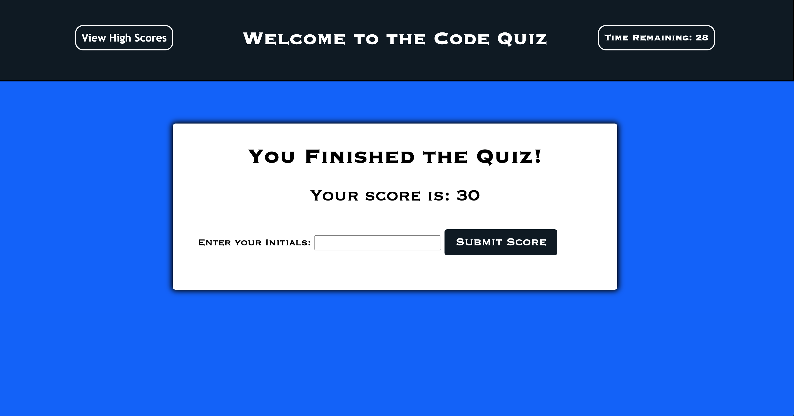
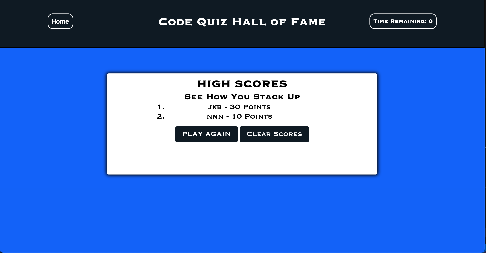

# Code-Quiz# Password-Generator

1. [ Description. ](#desc)
2. [ Web Address. ](#web-address)
3. [ Contributions. ](#contributions)

## 1. Description

I created a coding quiz that stores the high scores of the users.
the home page has the title screen with instructions of how to play and 
the start button to begin the game. On the header is a link to the High Scores page on 
the left and the timer on the right.
When you click start the question and 4 options will appear. The timer will also 
begin counting down from 75 seconds.
When you click on your answer choice the correct answer will be highlighted in blue
while the wrong answers will turn red. 
If you answer a question wrong, 10 seconds will be removed from the timer.
You will then be presented with a NEXT button to move on to the next question.
The games will end when all the questions are answered or if the timer reaches 0.
A GAME OVER screen will pop up and tell you the quiz is finished.
It will also display your score and ask to input your initials. 
when you click the submit button you will be directed to the High Scores page,
where your initials and score will be listed. 
If other people play, you can compare your scores.
there will be 2 buttons on the bottom. One will bring you back to the beginning of the quiz to play again.
the other button will clear all of the scores on the high score list.

Application will deploy live with no errors and all files can be seen in my Github Repository

## 2. How to Get There

### Click link to open in your browser.

[github pages site] https://jbarbss.github.io/Code-Quiz/

[github repository site] https://github.com/Jbarbss/Code-Quiz

### Deployed application screen shot

## 3. Contributions
Thank you to the following for their suggestions and insights.

Ben durham

Steve Marsh

Patrick Walker

Gabe Thomas

Takuya Matsumoto
